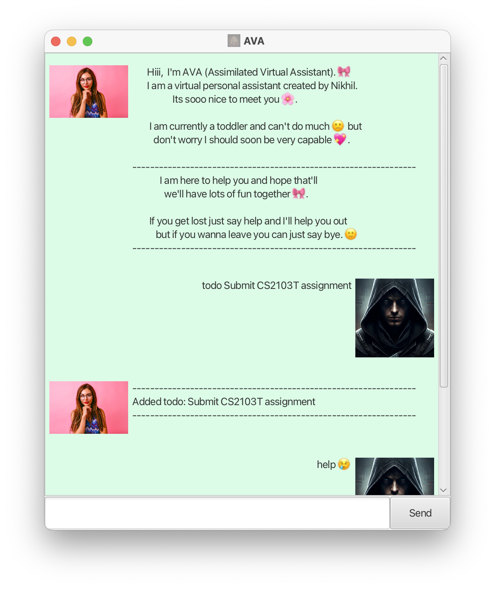

# AVA User Guide



AVA is a desktop app for managing tasks, optimized for use via a Command Line Interface (CLI)
while still having the benefits of a Graphical User Interface (GUI).  
If you can type fast, AVA can get your task management done faster than traditional GUI apps.

AVA has the personality of a helpful young woman.  

## Index
* [Quick Start](#quick-start)
* [Features](#features)
  1. [List all tasks - `LIST`](#list)
  2. [Add a todo task - `TODO`](#todo)
  3. [Add an event task - `EVENT`](#event)
  4. [Add a deadline task - `DEADLINE`](#deadline)
  5. [Delete a task - `DELETE`](#delete)
  6. [Mark a task as done - `MARK`](#mark)
  7. [Unmark a task - `UNMARK`](#unmark)
  8. [Find tasks - `FIND`](#find)
  9. [Leave - `BYE`](#bye)
  10. [Get help - `HELP`](#help)

***

## Quick Start
1. Ensure that you have Java `17` or above installed on your Computer.
2. Download the latest `ava.jar` file from [here](https://github.com/Timenikhil/ip/releases/latest/download/ava.jar)
3. Copy the file to the folder you want to use as the home folder for AVA.
4. Open a command terminal, cd into the folder you put the jar file in, and use the `java -jar ava.jar` command to run the application.
 ```
 A GUI similar to the one above should appear in a few seconds.
 ```
 > Alternatively double-click the file to start the app.
5. Type the command in the command box and press Enter to execute it.
> e.g. typing `help` and pressing Enter will show a help response.
6. Refer to the [Features](#features) below for details of each command.


***

## Features

* Commands are case insensitive but values passed are case sensitive.

* Extraneous parameters for commands that do not take in parameters (such as help, list and bye) will be ignored.
e.g. if the command specifies help 123, it will be interpreted as help

### List 

Shows a list of all the tasks AVA remembers.

* ####  Command : `LIST`

* #### Example: 

```
list
```

### Todo

Stores a Todo item.

* ####  Command : `TODO <task>`

* #### Example:

```
todo homework
```
Creates a new task with the description "homework".

### Event

Creates and stores an event item.

* ####  Command : `EVENT <task> /from <date> /to <date>`

* #### Example:

```
Meeting /from 2023-10-01T10:00 /to 2023-10-01T12:00
```

Creates a new task with the description "Meeting" 
and the date from 10:00 to 12:00 on 1st October 2023.

### Deadline

Creates and stores a deadline item.

* ####  Command : `DEADLINE <task> /by <date>`

* #### Example:

```
Assignment /by 2023-10-01T23:59
```

Creates a new task with the description "Assignment" 
and the deadline at 23:59 on 1st October 2023.

### Delete

Deletes an item by id.

* ####  Command : `DELETE <id>`

* #### Example:

```
delete 1
```

Deletes the first task.

### Mark

Marks a task as done.

* ####  Command : `MARK <id>`

* #### Example:

```
mark 1
```

Marks the first task as done.

### Unmark

Marks a task as not done.

* ####  Command : `UNMARK <id>`

* #### Example:

```
unmark 1
```

Marks the first task as not done.

### Find

Finds all tasks that contain the given keyword.

* ####  Command : `FIND <keyword>`

* #### Example:

```
find homework
```

Finds all tasks that contain the keyword "homework".

### Bye

Ends and closes the program with a farewell.

* ####  Command : `BYE`

* #### Example:

```
bye
```

### Help

Shows the help page.

* ####  Command : `HELP`

* #### Example:

```
help
```
